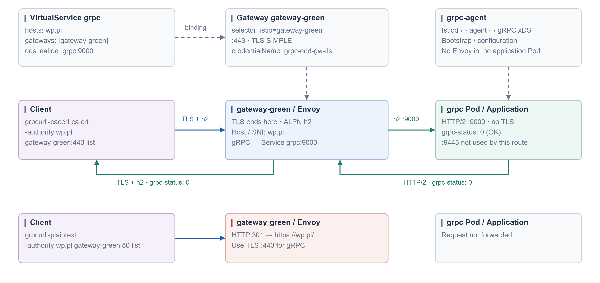

#### gRPC → gateway-green → grpc:9000

Use the existing gateway namespace for these resources and the TLS Secret. Workload injection must be enabled. `grpc-agent` requires an xDS-enabled gRPC application; the supplied image is retained. Port 9000 serves plaintext gRPC; port 9443 is not used by this route.

```yaml
apiVersion: v1
kind: ServiceAccount
metadata:
  name: grpc
---
apiVersion: apps/v1
kind: Deployment
metadata:
  name: grpc
  labels:
    app: grpc
spec:
  replicas: 1
  selector:
    matchLabels:
      app: grpc
  template:
    metadata:
      labels:
        app: grpc
      annotations:
        sidecar.istio.io/logLevel: debug
        inject.istio.io/templates: grpc-agent
        proxy.istio.io/config: '{"holdApplicationUntilProxyStarts": true}'
    spec:
      serviceAccountName: grpc
      containers:
      - name: grpc
        image: seemscloud/grpc-server:latest
        imagePullPolicy: Always
        securityContext:
          runAsNonRoot: true
          runAsGroup: 1000
          runAsUser: 1000
        ports:
        - containerPort: 9000
        - containerPort: 9443
        env:
        - name: LISTEN_PORT
          value: '9000'
        - name: LISTEN_PORT_TLS
          value: '9443'
        - name: GRPC_VERBOSITY
          value: DEBUG
        - name: GRPC_TRACE
          value: all
---
apiVersion: v1
kind: Service
metadata:
  name: grpc
spec:
  type: ClusterIP
  selector:
    app: grpc
  ports:
  - name: grpc
    appProtocol: grpc
    protocol: TCP
    port: 9000
    targetPort: 9000
```

```yaml
apiVersion: networking.istio.io/v1
kind: Gateway
metadata:
  name: grpc
spec:
  selector:
    istio: gateway-green
  servers:
  - hosts: [wp.pl]
    port:
      name: http2
      protocol: HTTP2
      number: 80
    tls:
      httpsRedirect: true
  - hosts: [wp.pl]
    port:
      name: https
      protocol: HTTPS
      number: 443
    tls:
      mode: SIMPLE
      credentialName: grpc-end-gw-tls
---
apiVersion: networking.istio.io/v1
kind: VirtualService
metadata:
  name: grpc
spec:
  gateways: [grpc]
  hosts: [wp.pl]
  exportTo: [.]
  http:
  - route:
    - destination:
        host: grpc
        port:
          number: 9000
```



#### TLS Secret

`wp.pl.crt` must cover `wp.pl` and match `wp.pl.key`; `ca.crt` is its trusted CA. Run in the gateway namespace selected in the current kubectl context.

```bash
kubectl create secret tls grpc-end-gw-tls --cert=wp.pl.crt --key=wp.pl.key --dry-run=client -o yaml | kubectl apply -f -
kubectl apply -f gateway-grpc/app.yaml -f gateway-grpc/gateway.yaml
```

#### Request

From a client in the same namespace, with `grpcurl` and `ca.crt`. `list` requires server reflection; without reflection, supply the application `.proto` and RPC method.

```bash
grpcurl -cacert ca.crt -authority wp.pl gateway-green:443 list
```
