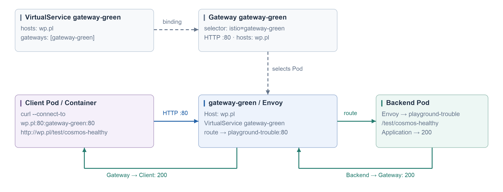
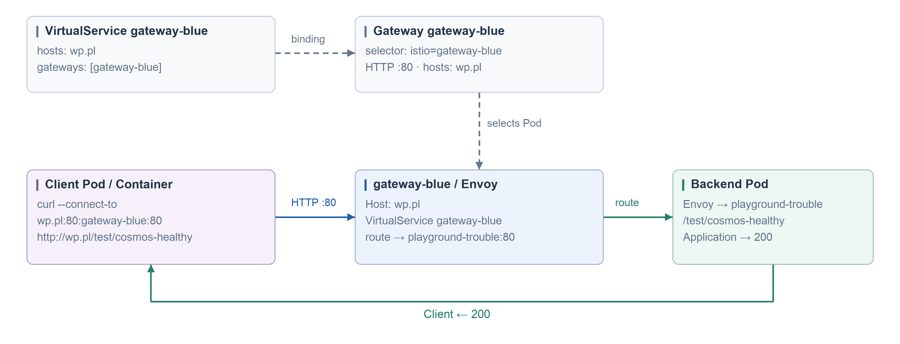

#### gateway-green

```yaml
apiVersion: networking.istio.io/v1
kind: Gateway
metadata:
  name: wp-green
spec:
  selector:
    istio: gateway-green
  servers:
  - port:
      number: 80
      name: http
      protocol: HTTP
    hosts: [wp.pl]
---
apiVersion: networking.istio.io/v1
kind: VirtualService
metadata:
  name: wp-green
spec:
  hosts: [wp.pl]
  gateways: [wp-green]
  exportTo: [.]
  http:
  - route:
    - destination:
        host: playground-trouble.prod-playground-trouble.svc.cluster.local
        port:
          number: 80
```



#### gateway-blue

```yaml
apiVersion: networking.istio.io/v1
kind: Gateway
metadata:
  name: wp-blue
spec:
  selector:
    istio: gateway-blue
  servers:
  - port:
      number: 80
      name: http
      protocol: HTTP
    hosts: [wp.pl]
---
apiVersion: networking.istio.io/v1
kind: VirtualService
metadata:
  name: wp-blue
spec:
  hosts: [wp.pl]
  gateways: [wp-blue]
  exportTo: [.]
  http:
  - route:
    - destination:
        host: playground-trouble.prod-playground-trouble.svc.cluster.local
        port:
          number: 80
```


