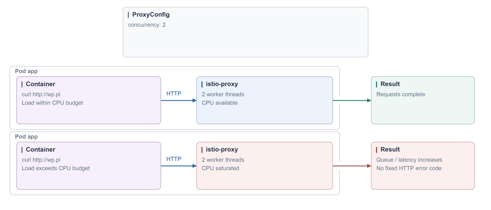
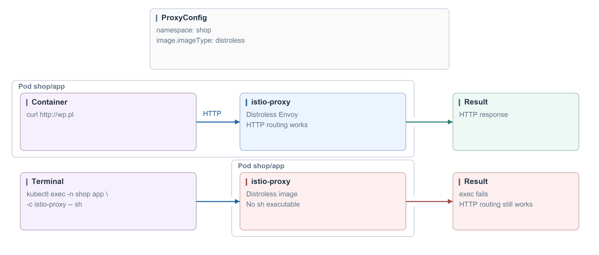
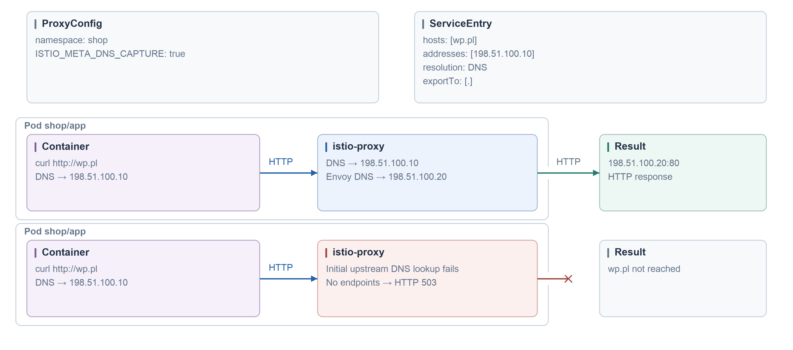
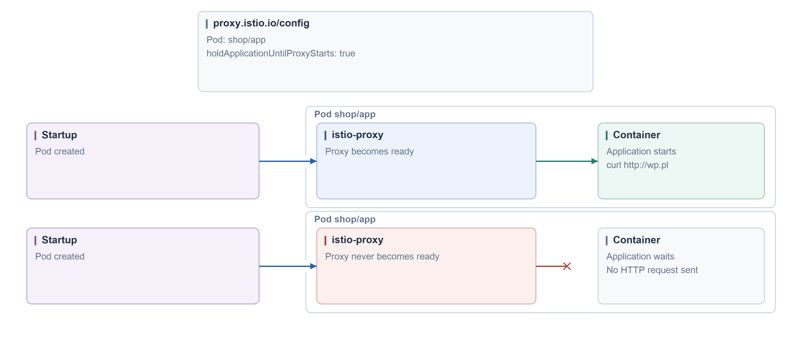
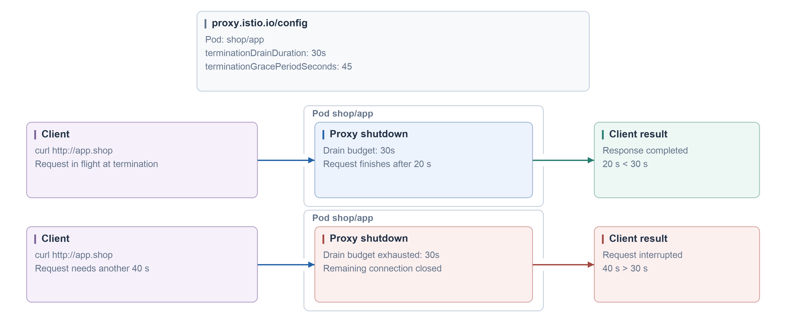
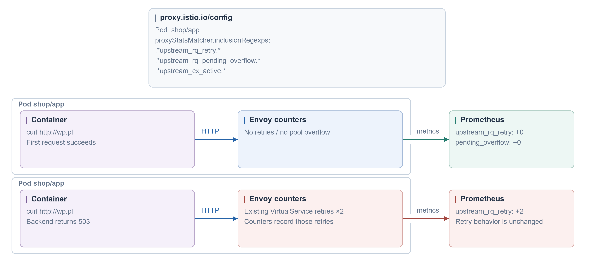

#### Concurrency · ProxyConfig

```yaml
apiVersion: networking.istio.io/v1beta1
kind: ProxyConfig
metadata:
  name: default
spec:
  concurrency: 2
```



#### Distroless · ProxyConfig

```yaml
apiVersion: networking.istio.io/v1beta1
kind: ProxyConfig
metadata:
  name: default
spec:
  image:
    imageType: distroless
```



#### DNS capture · ProxyConfig

```yaml
apiVersion: networking.istio.io/v1beta1
kind: ProxyConfig
metadata:
  name: default
spec:
  environmentVariables:
    ISTIO_META_DNS_CAPTURE: 'true'
---
apiVersion: networking.istio.io/v1
kind: ServiceEntry
metadata:
  name: wp
spec:
  hosts: [wp.pl]
  addresses: [198.51.100.10]
  exportTo: [.]
  location: MESH_EXTERNAL
  resolution: DNS
  ports:
  - number: 80
    name: http
    protocol: HTTP
```



#### Startup · Pod annotation

```yaml
apiVersion: v1
kind: Pod
metadata:
  name: app
  annotations:
    proxy.istio.io/config: |
      holdApplicationUntilProxyStarts: true
spec:
  containers:
  - name: app
    image: curlimages/curl:8.16.0
    command: [sh, -c, 'curl --fail --max-time 10 http://wp.pl; sleep 3600']
```



#### Shutdown · Pod annotation

```yaml
apiVersion: v1
kind: Pod
metadata:
  name: app
  labels:
    app: app
  annotations:
    proxy.istio.io/config: |
      terminationDrainDuration: 30s
spec:
  terminationGracePeriodSeconds: 45
  containers:
  - name: app
    image: nginxinc/nginx-unprivileged:1.29-alpine3.22
    ports:
    - containerPort: 8080
```



#### Metrics · Pod annotation

```yaml
apiVersion: v1
kind: Pod
metadata:
  name: app
  annotations:
    proxy.istio.io/config: |
      proxyStatsMatcher:
        inclusionRegexps: [.*upstream_rq_retry.*, .*upstream_rq_pending_overflow.*, .*upstream_cx_active.*]
spec:
  containers:
  - name: app
    image: curlimages/curl:8.16.0
    command: [sh, -c, sleep 3600]
```


