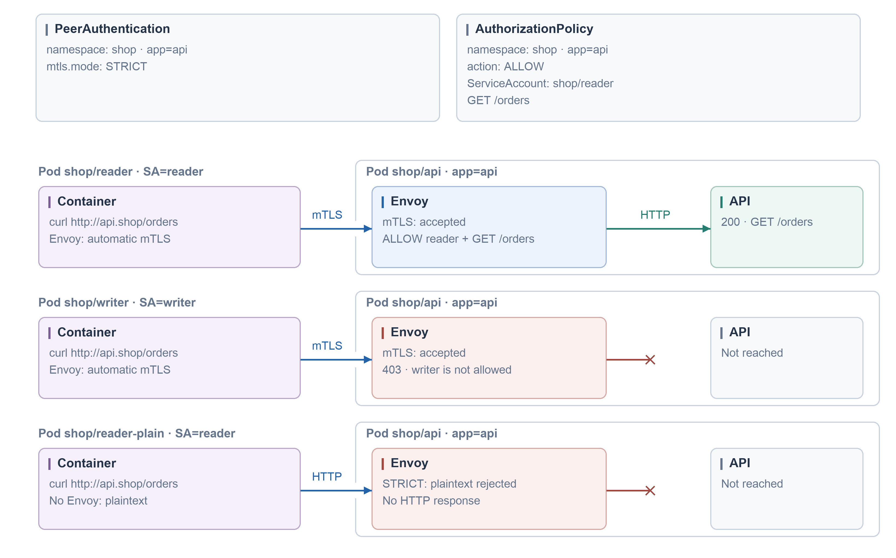
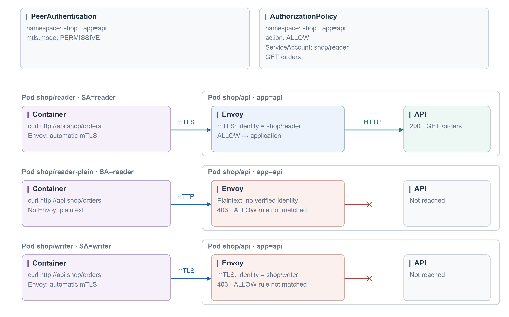
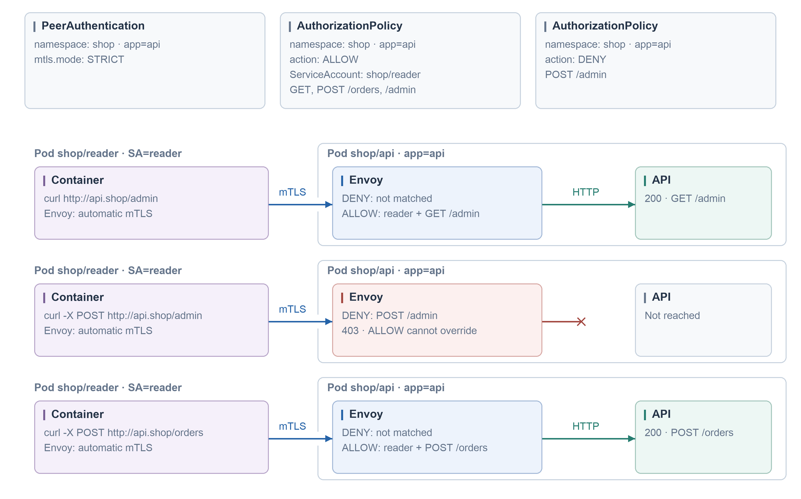

#### STRICT mTLS + allow one ServiceAccount

```yaml
# Apply one peer-authorization example at a time; no other matching policies.
# Existing shop/api (app=api): HTTP Service port 80 -> Pod port 8080; returns 200.
# Mesh trust domain: cluster.local. Injected clients use automatic Istio mTLS.
apiVersion: security.istio.io/v1
kind: PeerAuthentication
metadata:
  name: api-mtls
  namespace: shop
spec:
  selector:
    matchLabels:
      app: api
  mtls:
    mode: STRICT
---
apiVersion: security.istio.io/v1
kind: AuthorizationPolicy
metadata:
  name: api-access
  namespace: shop
spec:
  selector:
    matchLabels:
      app: api
  action: ALLOW
  rules:
    - from:
        - source:
            principals:
              - cluster.local/ns/shop/sa/reader
      to:
        - operation:
            methods: [GET]
            paths: [/orders]
```



#### PERMISSIVE does not grant a ServiceAccount identity

```yaml
# Alternative to strict-reader.yaml; existing shop/api returns 200 /orders.
# Plaintext passes PeerAuthentication but carries no authenticated ServiceAccount.
apiVersion: security.istio.io/v1
kind: PeerAuthentication
metadata:
  name: api-mtls
  namespace: shop
spec:
  selector:
    matchLabels:
      app: api
  mtls:
    mode: PERMISSIVE
---
apiVersion: security.istio.io/v1
kind: AuthorizationPolicy
metadata:
  name: api-access
  namespace: shop
spec:
  selector:
    matchLabels:
      app: api
  action: ALLOW
  rules:
    - from:
        - source:
            principals:
              - cluster.local/ns/shop/sa/reader
      to:
        - operation:
            methods: [GET]
            paths: [/orders]
```



#### DENY wins over ALLOW

```yaml
# Alternative example; existing shop/api returns 200 for GET/POST /orders and /admin.
# DENY is evaluated before ALLOW. Workload port is 8080 (Service port is 80).
apiVersion: security.istio.io/v1
kind: PeerAuthentication
metadata:
  name: api-mtls
  namespace: shop
spec:
  selector:
    matchLabels:
      app: api
  mtls:
    mode: STRICT
---
apiVersion: security.istio.io/v1
kind: AuthorizationPolicy
metadata:
  name: api-access
  namespace: shop
spec:
  selector:
    matchLabels:
      app: api
  action: ALLOW
  rules:
    - from:
        - source:
            principals: [cluster.local/ns/shop/sa/reader]
      to:
        - operation:
            methods: [GET, POST]
            paths: [/orders, /admin]
---
apiVersion: security.istio.io/v1
kind: AuthorizationPolicy
metadata:
  name: api-deny-admin-write
  namespace: shop
spec:
  selector:
    matchLabels:
      app: api
  action: DENY
  rules:
    - to:
        - operation:
            ports: ["8080"]
            methods: [POST]
            paths: [/admin]
```


