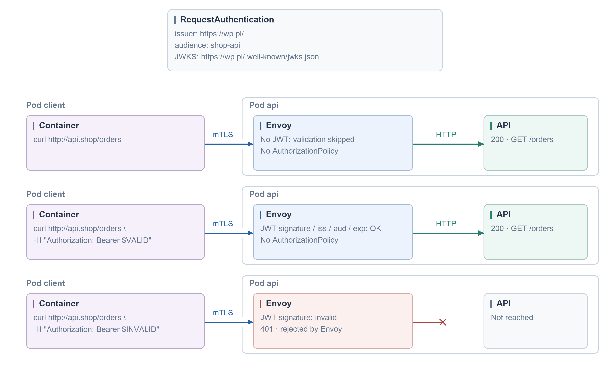
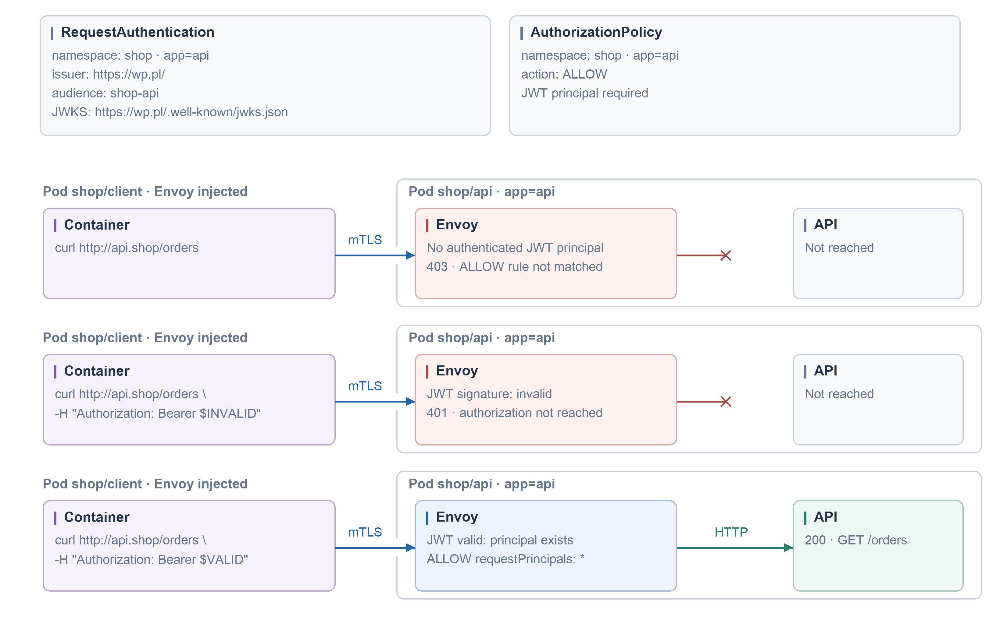
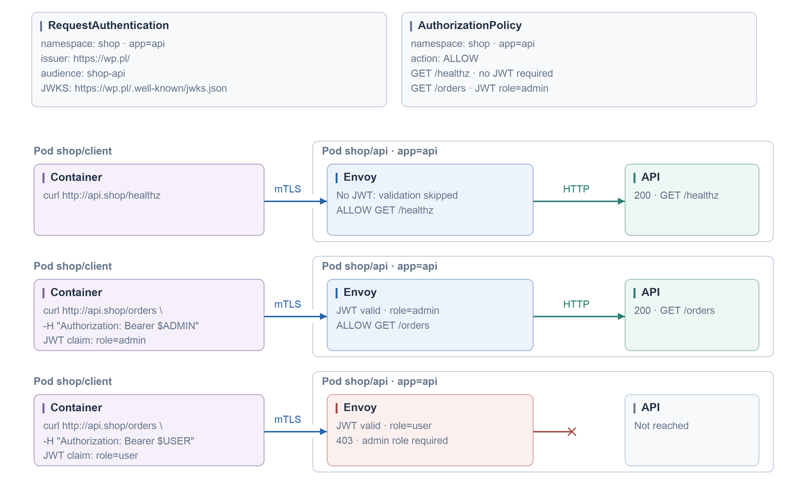

#### JWT validation

```yaml
apiVersion: security.istio.io/v1
kind: RequestAuthentication
metadata:
  name: api-jwt
  namespace: shop
spec:
  selector:
    matchLabels:
      app: api
  jwtRules:
    - issuer: https://issuer.example.test/
      audiences: [shop-api]
      jwksUri: https://issuer.example.test/.well-known/jwks.json
```



#### Required JWT

```yaml
apiVersion: security.istio.io/v1
kind: RequestAuthentication
metadata:
  name: api-jwt
  namespace: shop
spec:
  selector:
    matchLabels:
      app: api
  jwtRules:
    - issuer: https://issuer.example.test/
      audiences: [shop-api]
      jwksUri: https://issuer.example.test/.well-known/jwks.json
---
apiVersion: security.istio.io/v1
kind: AuthorizationPolicy
metadata:
  name: api-jwt-access
  namespace: shop
spec:
  selector:
    matchLabels:
      app: api
  action: ALLOW
  rules:
    - from:
        - source:
            requestPrincipals: ["*"]
```



#### JWT role + /healthz

```yaml
apiVersion: security.istio.io/v1
kind: RequestAuthentication
metadata:
  name: api-jwt
  namespace: shop
spec:
  selector:
    matchLabels:
      app: api
  jwtRules:
    - issuer: https://issuer.example.test/
      audiences: [shop-api]
      jwksUri: https://issuer.example.test/.well-known/jwks.json
---
apiVersion: security.istio.io/v1
kind: AuthorizationPolicy
metadata:
  name: api-jwt-access
  namespace: shop
spec:
  selector:
    matchLabels:
      app: api
  action: ALLOW
  rules:
    - to:
        - operation:
            methods: [GET]
            paths: [/healthz]
    - from:
        - source:
            requestPrincipals: ["*"]
      to:
        - operation:
            methods: [GET]
            paths: [/orders]
      when:
        - key: request.auth.claims[role]
          values: [admin]
```


