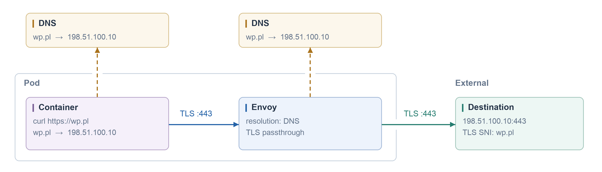
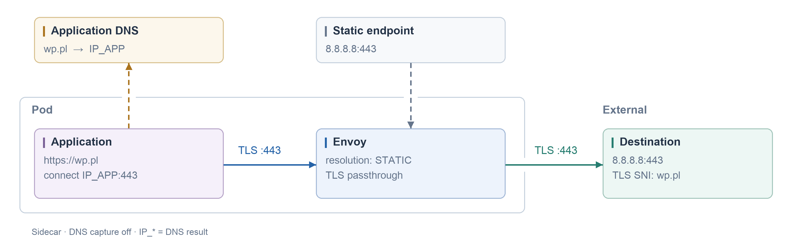
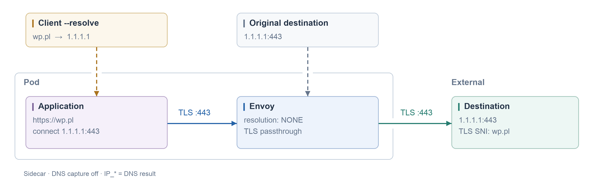
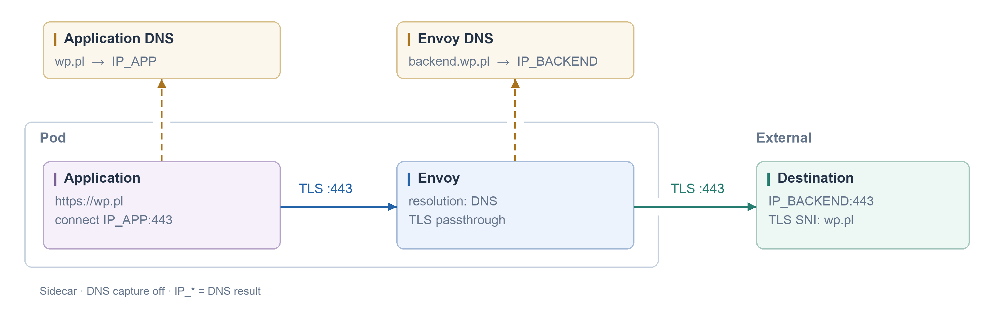

#### Normal

```yaml
apiVersion: networking.istio.io/v1
kind: ServiceEntry
metadata:
  name: default
spec:
  hosts: [wp.pl]
  location: MESH_EXTERNAL
  resolution: DNS
  ports: [{number: 443, name: https, protocol: TLS}]
```



#### Override Egress IP, not DNS IP

```yaml
apiVersion: networking.istio.io/v1
kind: ServiceEntry
metadata:
  name: default
spec:
  hosts: [wp.pl]
  location: MESH_EXTERNAL
  resolution: STATIC
  ports: [{number: 443, name: https, protocol: TLS}]
  endpoints: [{address: 8.8.8.8}]
```



#### Original destination — resolution: NONE

```yaml
apiVersion: networking.istio.io/v1
kind: ServiceEntry
metadata:
  name: default
spec:
  hosts: [wp.pl]
  addresses:
  - 1.1.1.1
  - 1.0.0.1
  ports: [{number: 443, name: https, protocol: TLS}]
  location: MESH_EXTERNAL
  resolution: NONE
```



#### DNS Resolution + Different Domain

```yaml
apiVersion: networking.istio.io/v1
kind: ServiceEntry
metadata:
  name: default
spec:
  hosts: [wp.pl]
  location: MESH_EXTERNAL
  resolution: DNS
  ports: [{number: 443, name: https, protocol: TLS}]
  endpoints: [{address: backend.wp.pl}]
```



#### Istio 80, egress 4433

```yaml
apiVersion: networking.istio.io/v1
kind: ServiceEntry
metadata:
  name: wp
spec:
  hosts: [wp.pl]
  location: MESH_EXTERNAL
  resolution: DNS
  ports: [{number: 80, name: http, protocol: HTTP, targetPort: 4433}]
---
apiVersion: networking.istio.io/v1
kind: DestinationRule
metadata:
  name: external-api
spec:
  host: wp.pl
  trafficPolicy:
    portLevelSettings: [{port: {number: 80}, tls: {mode: SIMPLE}}]
```


