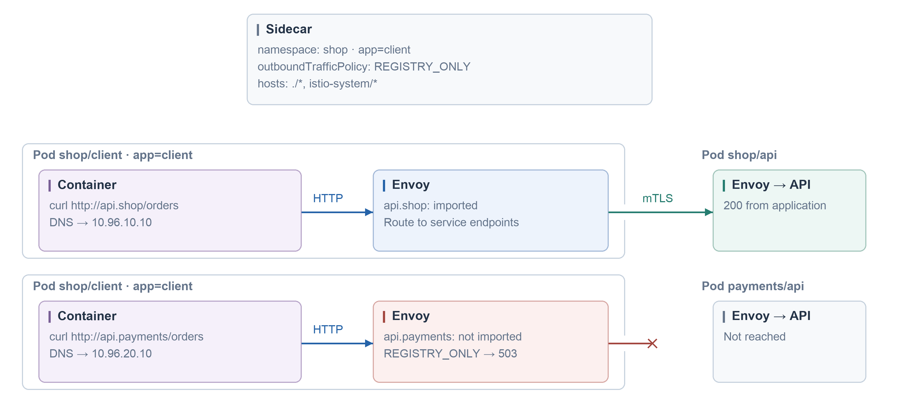
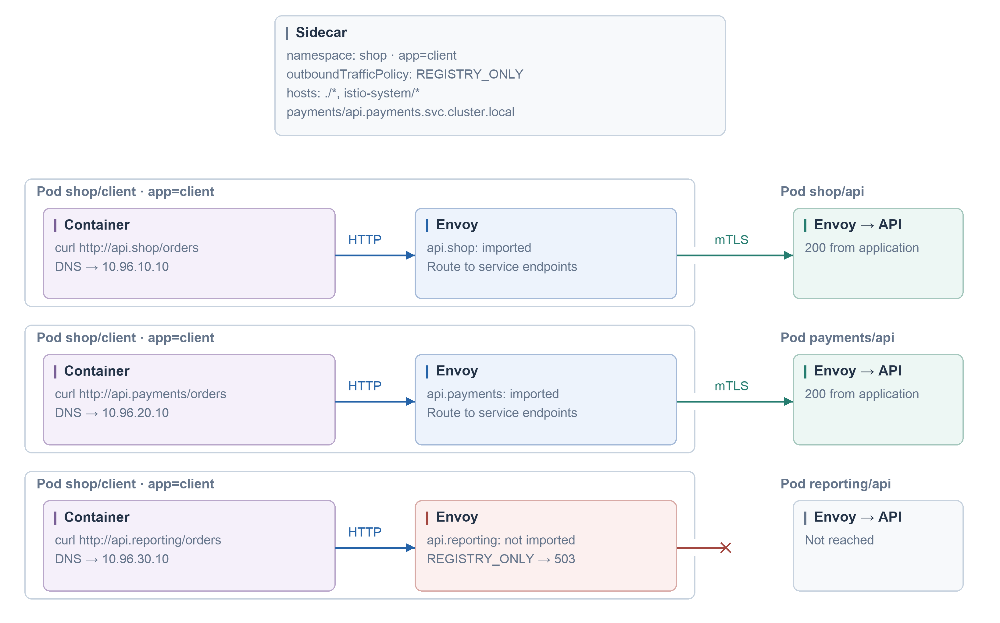
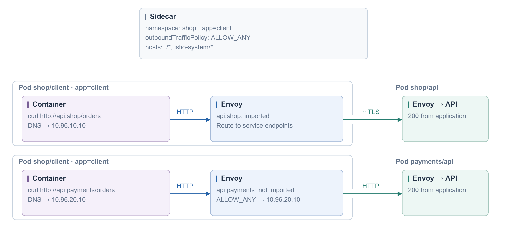

#### Import only the local namespace

```yaml
# Alternatives: apply one Sidecar example at a time in namespace shop.
# Existing HTTP Services: api.shop, api.payments, api.reporting (port 80).
# Client: shop/client, app=client. Client/API sidecars injected; APIs return 200 /orders.
apiVersion: networking.istio.io/v1
kind: Sidecar
metadata:
  name: client-egress
  namespace: shop
spec:
  workloadSelector:
    labels:
      app: client
  outboundTrafficPolicy:
    mode: REGISTRY_ONLY
  egress:
    - hosts:
        - "./*"
        - "istio-system/*"
```



#### Import one service from another namespace

```yaml
# Alternative to local-only.yaml; existing Services are exported to shop.
# Client: shop/client, app=client. Client/API sidecars injected; APIs return 200 /orders.
apiVersion: networking.istio.io/v1
kind: Sidecar
metadata:
  name: client-egress
  namespace: shop
spec:
  workloadSelector:
    labels:
      app: client
  outboundTrafficPolicy:
    mode: REGISTRY_ONLY
  egress:
    - hosts:
        - "./*"
        - "istio-system/*"
        - "payments/api.payments.svc.cluster.local"
```



#### ALLOW_ANY: an unimported service can still be reached

```yaml
# Alternative to local-only.yaml. Sidecar scopes configuration, not network security.
# Existing api.payments accepts plaintext HTTP; no destination authorization policy.
# Client: shop/client, app=client. Client/API sidecars injected; APIs return 200 /orders.
apiVersion: networking.istio.io/v1
kind: Sidecar
metadata:
  name: client-egress
  namespace: shop
spec:
  workloadSelector:
    labels:
      app: client
  outboundTrafficPolicy:
    mode: ALLOW_ANY
  egress:
    - hosts:
        - "./*"
        - "istio-system/*"
```


