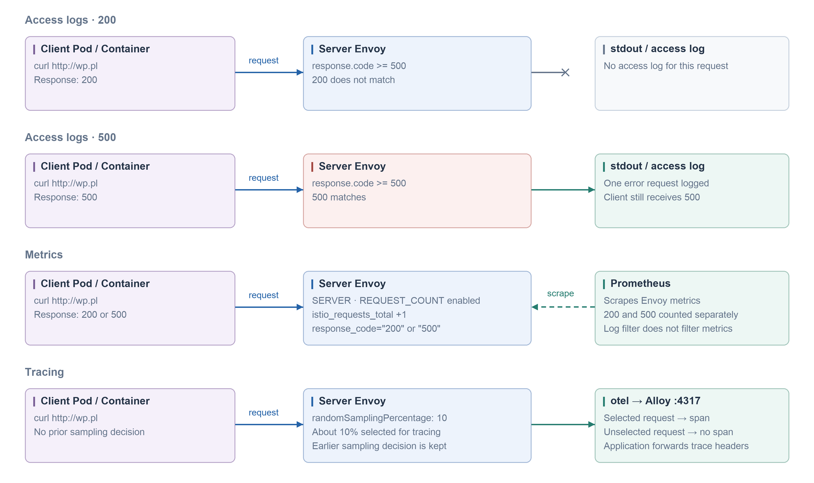

#### Access logs + metrics + tracing

Use in the workload namespace, outside the mesh root namespace. Tracing requires `meshConfig.enableTracing: true` and provider `otel`; `istio-setup` configures it for Alloy on port 4317. Prometheus must scrape the proxies.

```yaml
apiVersion: telemetry.istio.io/v1
kind: Telemetry
metadata:
  name: default
spec:
  accessLogging:
  - providers:
    - name: envoy
    filter:
      expression: response.code >= 500
  metrics:
  - providers:
    - name: prometheus
    overrides:
    - match:
        metric: REQUEST_COUNT
        mode: SERVER
      disabled: false
  tracing:
  - providers:
    - name: otel
    randomSamplingPercentage: 10
```


