#### Subsets

```yaml
apiVersion: networking.istio.io/v1
kind: DestinationRule
metadata:
  name: playground-trouble
spec:
  host: playground-trouble.prod-playground-trouble.svc.cluster.local
  exportTo: [.]
  trafficPolicy:
    loadBalancer:
      simple: ROUND_ROBIN
    outlierDetection:
      consecutive5xxErrors: 3
      interval: 1s
      baseEjectionTime: 5s
      maxEjectionPercent: 50
      minHealthPercent: 0
  subsets:
  - name: connections
    labels:
      app.kubernetes.io/name: playground-trouble
    trafficPolicy:
      connectionPool:
        tcp:
          maxConnections: 1
        http:
          http1MaxPendingRequests: 1
          http2MaxRequests: 1
          h2UpgradePolicy: DO_NOT_UPGRADE
      outlierDetection:
        consecutive5xxErrors: 0
  - name: scenarios
    labels:
      app.kubernetes.io/name: playground-trouble
    trafficPolicy:
      outlierDetection:
        consecutive5xxErrors: 0
```

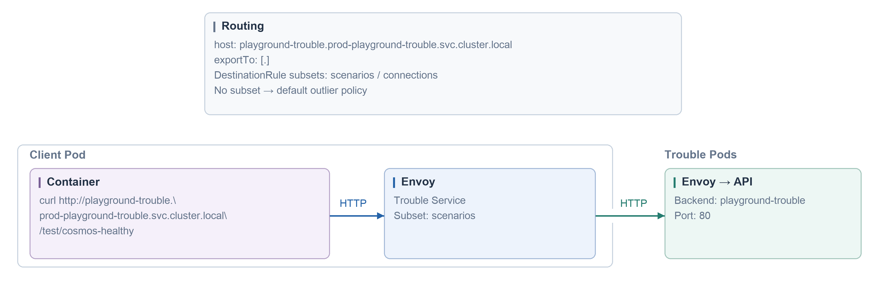

#### No retry

```yaml
apiVersion: networking.istio.io/v1
kind: VirtualService
metadata:
  name: trouble-no-retry
spec:
  hosts: [playground-trouble.prod-playground-trouble.svc.cluster.local]
  gateways: [mesh]
  exportTo: [.]
  http:
  - name: trouble-healthy
    match:
    - gateways: [mesh]
      uri:
        exact: /test/cosmos-healthy
    route:
    - destination:
        host: playground-trouble.prod-playground-trouble.svc.cluster.local
        subset: scenarios
        port:
          number: 80
    retries:
      attempts: 0
    timeout: 10s
  - name: trouble-flaky
    match:
    - gateways: [mesh]
      uri:
        exact: /test/cosmos-flaky
    route:
    - destination:
        host: playground-trouble.prod-playground-trouble.svc.cluster.local
        subset: scenarios
        port:
          number: 80
    retries:
      attempts: 0
    timeout: 10s
```

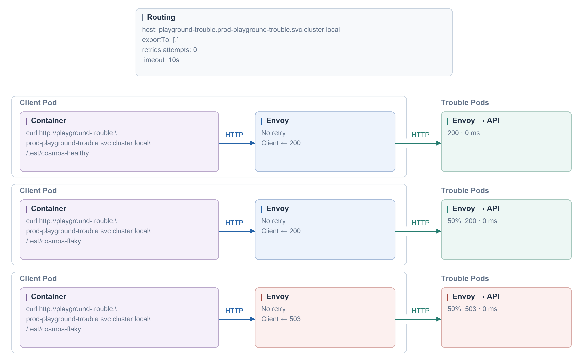

#### Retry

```yaml
apiVersion: networking.istio.io/v1
kind: VirtualService
metadata:
  name: trouble-retry
spec:
  hosts: [playground-trouble.prod-playground-trouble.svc.cluster.local]
  gateways: [mesh]
  exportTo: [.]
  http:
  - name: trouble-retry
    match:
    - gateways: [mesh]
      uri:
        exact: /test/cosmos-retry
    route:
    - destination:
        host: playground-trouble.prod-playground-trouble.svc.cluster.local
        subset: scenarios
        port:
          number: 80
    retries:
      attempts: 2
      perTryTimeout: 1s
      retryOn: 5xx
      retryIgnorePreviousHosts: true
    timeout: 10s
```

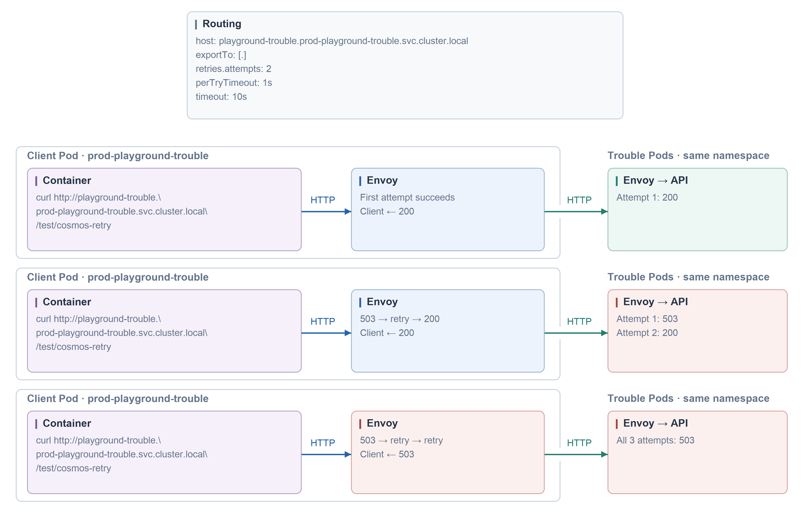

#### Per-try timeout

```yaml
apiVersion: networking.istio.io/v1
kind: VirtualService
metadata:
  name: trouble-retry-timeout
spec:
  hosts: [playground-trouble.prod-playground-trouble.svc.cluster.local]
  gateways: [mesh]
  exportTo: [.]
  http:
  - name: trouble-retry-timeout
    match:
    - gateways: [mesh]
      uri:
        exact: /test/cosmos-retry-timeout
    route:
    - destination:
        host: playground-trouble.prod-playground-trouble.svc.cluster.local
        subset: scenarios
        port:
          number: 80
    retries:
      attempts: 2
      perTryTimeout: 500ms
      retryOn: 5xx
      retryIgnorePreviousHosts: true
    timeout: 3s
```

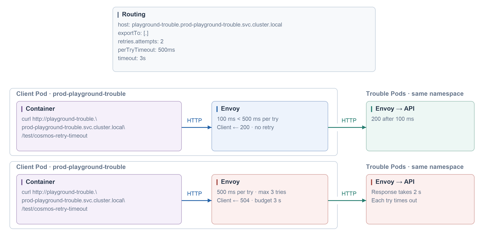

#### Fault abort

```yaml
apiVersion: networking.istio.io/v1
kind: VirtualService
metadata:
  name: trouble-fault-abort
spec:
  hosts: [playground-trouble.prod-playground-trouble.svc.cluster.local]
  gateways: [mesh]
  exportTo: [.]
  http:
  - name: trouble-fault-abort
    match:
    - gateways: [mesh]
      uri:
        exact: /test/cosmos-fault-abort
    route:
    - destination:
        host: playground-trouble.prod-playground-trouble.svc.cluster.local
        subset: scenarios
        port:
          number: 80
    retries:
      attempts: 0
    timeout: 10s
    fault:
      abort:
        httpStatus: 503
        percentage:
          value: 50
```

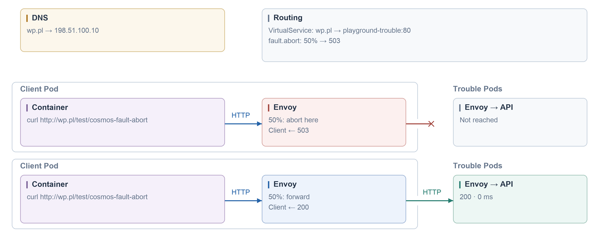

#### Fault delay

```yaml
apiVersion: networking.istio.io/v1
kind: VirtualService
metadata:
  name: trouble-fault-delay
spec:
  hosts: [playground-trouble.prod-playground-trouble.svc.cluster.local]
  gateways: [mesh]
  exportTo: [.]
  http:
  - name: trouble-healthy
    match:
    - gateways: [mesh]
      uri:
        exact: /test/cosmos-healthy
    route:
    - destination:
        host: playground-trouble.prod-playground-trouble.svc.cluster.local
        subset: scenarios
        port:
          number: 80
    retries:
      attempts: 0
    timeout: 10s
  - name: trouble-fault-delay
    match:
    - gateways: [mesh]
      uri:
        exact: /test/cosmos-fault-delay
    route:
    - destination:
        host: playground-trouble.prod-playground-trouble.svc.cluster.local
        subset: scenarios
        port:
          number: 80
    retries:
      attempts: 0
    timeout: 10s
    fault:
      delay:
        fixedDelay: 2s
        percentage:
          value: 100
```

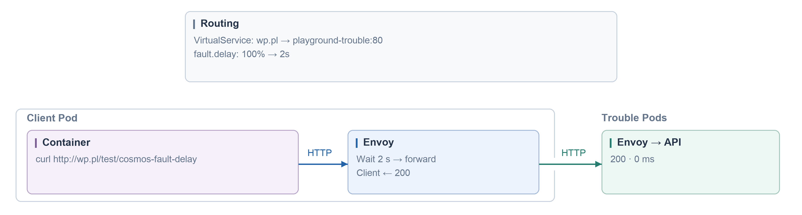

#### Header match

```yaml
apiVersion: networking.istio.io/v1
kind: VirtualService
metadata:
  name: trouble-header-fault
spec:
  hosts: [playground-trouble.prod-playground-trouble.svc.cluster.local]
  gateways: [mesh]
  exportTo: [.]
  http:
  - name: trouble-header-fault
    match:
    - gateways: [mesh]
      uri:
        exact: /test/cosmos-header-fault
      headers:
        x-demo-fault:
          exact: 'yes'
    route:
    - destination:
        host: playground-trouble.prod-playground-trouble.svc.cluster.local
        subset: scenarios
        port:
          number: 80
    retries:
      attempts: 0
    timeout: 10s
    fault:
      abort:
        httpStatus: 503
        percentage:
          value: 100
  - name: trouble-header-fault-healthy
    match:
    - gateways: [mesh]
      uri:
        exact: /test/cosmos-header-fault
    route:
    - destination:
        host: playground-trouble.prod-playground-trouble.svc.cluster.local
        subset: scenarios
        port:
          number: 80
    retries:
      attempts: 0
    timeout: 10s
```

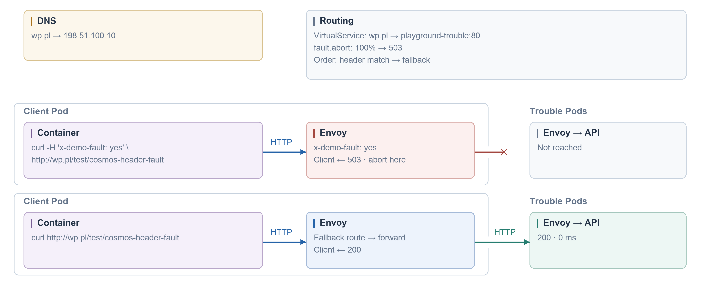

#### Connection pool

```yaml
apiVersion: networking.istio.io/v1
kind: VirtualService
metadata:
  name: trouble-connections
spec:
  hosts: [playground-trouble.prod-playground-trouble.svc.cluster.local]
  gateways: [mesh]
  exportTo: [.]
  http:
  - name: trouble-connections
    match:
    - gateways: [mesh]
      uri:
        exact: /test/cosmos-connections
    route:
    - destination:
        host: playground-trouble.prod-playground-trouble.svc.cluster.local
        subset: connections
        port:
          number: 80
    retries:
      attempts: 0
    timeout: 10s
```

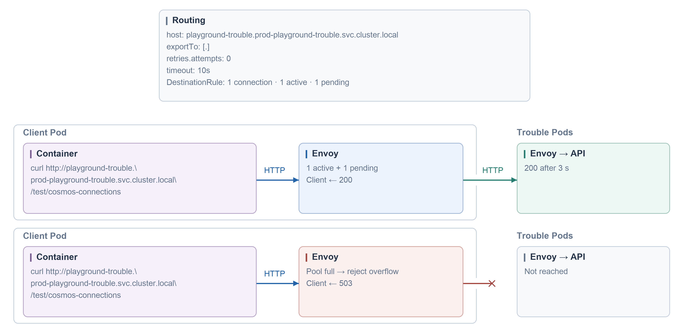

#### Request timeout

```yaml
apiVersion: networking.istio.io/v1
kind: VirtualService
metadata:
  name: trouble-timeout
spec:
  hosts: [playground-trouble.prod-playground-trouble.svc.cluster.local]
  gateways: [mesh]
  exportTo: [.]
  http:
  - name: trouble-timeout
    match:
    - gateways: [mesh]
      uri:
        exact: /test/cosmos-timeout
    route:
    - destination:
        host: playground-trouble.prod-playground-trouble.svc.cluster.local
        subset: connections
        port:
          number: 80
    retries:
      attempts: 0
    timeout: 1s
```

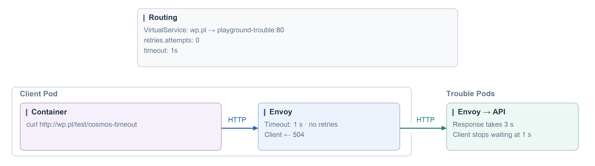

#### Outlier detection

```yaml
apiVersion: networking.istio.io/v1
kind: VirtualService
metadata:
  name: trouble-outlier
spec:
  hosts: [playground-trouble.prod-playground-trouble.svc.cluster.local]
  gateways: [mesh]
  exportTo: [.]
  http:
  - name: trouble-no-retry
    match:
    - gateways: [mesh]
    route:
    - destination:
        host: playground-trouble.prod-playground-trouble.svc.cluster.local
        port:
          number: 80
    retries:
      attempts: 0
    timeout: 10s
```

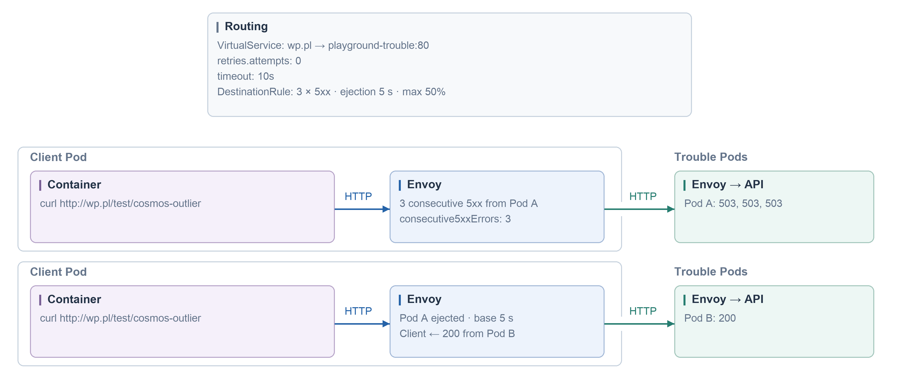

#### Local rate limit

```yaml
apiVersion: networking.istio.io/v1
kind: VirtualService
metadata:
  name: trouble-rate-limit
spec:
  hosts: [playground-trouble.prod-playground-trouble.svc.cluster.local]
  gateways: [mesh]
  exportTo: [.]
  http:
  - name: trouble-rate-limit
    match:
    - gateways: [mesh]
      uri:
        exact: /test/cosmos-rate-limit
    route:
    - destination:
        host: playground-trouble.prod-playground-trouble.svc.cluster.local
        subset: scenarios
        port:
          number: 80
    retries:
      attempts: 0
    timeout: 10s
---
apiVersion: networking.istio.io/v1alpha3
kind: EnvoyFilter
metadata:
  name: local-rate-limit
spec:
  configPatches:
  - applyTo: HTTP_FILTER
    match:
      context: SIDECAR_INBOUND
      listener:
        portNumber: 8080
        filterChain:
          filter:
            name: envoy.filters.network.http_connection_manager
            subFilter:
              name: envoy.filters.http.router
    patch:
      operation: INSERT_BEFORE
      value:
        name: envoy.filters.http.local_ratelimit
        typed_config:
          '@type': type.googleapis.com/envoy.extensions.filters.http.local_ratelimit.v3.LocalRateLimit
          stat_prefix: cosmos_rate_limit
  - applyTo: HTTP_ROUTE
    match:
      context: SIDECAR_INBOUND
      routeConfiguration:
        vhost:
          name: inbound|http|8080
          route:
            name: default
    patch:
      operation: INSERT_BEFORE
      value:
        name: local-rate-limit
        match:
          path: /test/cosmos-rate-limit
        route:
          cluster: inbound|8080||
          timeout: 0s
        typed_per_filter_config:
          envoy.filters.http.local_ratelimit:
            '@type': type.googleapis.com/envoy.extensions.filters.http.local_ratelimit.v3.LocalRateLimit
            stat_prefix: cosmos_rate_limit
            token_bucket:
              max_tokens: 3
              tokens_per_fill: 3
              fill_interval: 10s
            filter_enabled:
              default_value:
                numerator: 100
                denominator: HUNDRED
            filter_enforced:
              default_value:
                numerator: 100
                denominator: HUNDRED
            response_headers_to_add:
            - append_action: OVERWRITE_IF_EXISTS_OR_ADD
              header:
                key: x-local-rate-limit
                value: 'true'
```

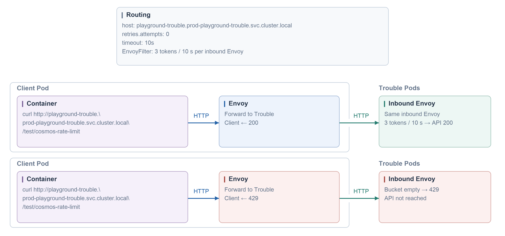
