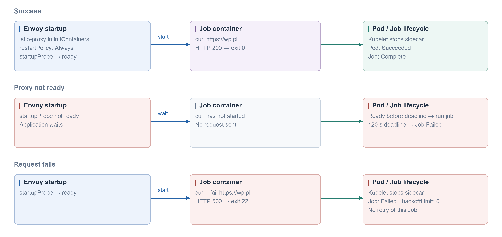

#### CronJob · native sidecar · Kubernetes 1.33+

```yaml
apiVersion: batch/v1
kind: CronJob
metadata:
  name: curl-wp
spec:
  schedule: '*/5 * * * *'
  concurrencyPolicy: Forbid
  successfulJobsHistoryLimit: 1
  failedJobsHistoryLimit: 1
  jobTemplate:
    spec:
      backoffLimit: 0
      activeDeadlineSeconds: 120
      ttlSecondsAfterFinished: 3600
      template:
        metadata:
          labels:
            sidecar.istio.io/inject: 'true'
          annotations:
            sidecar.istio.io/nativeSidecar: 'true'
        spec:
          restartPolicy: Never
          containers:
          - name: job
            image: curlimages/curl:8.16.0
            command: [curl]
            args: [--fail, --show-error, --silent, --connect-timeout, '10', --max-time, '30', 'https://wp.pl']
```

#### Istiod Helm · startup probe

```yaml
global:
  proxy:
    startupProbe:
      enabled: true
```


