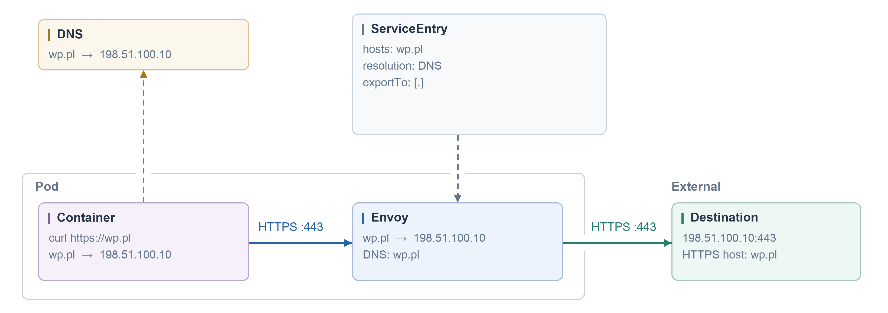
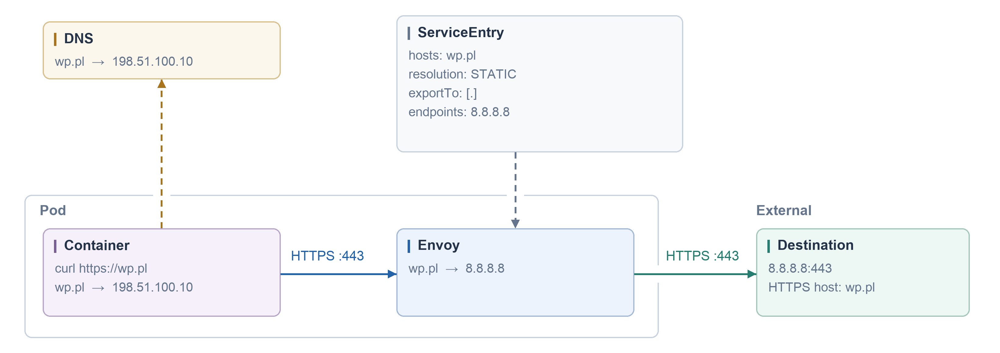
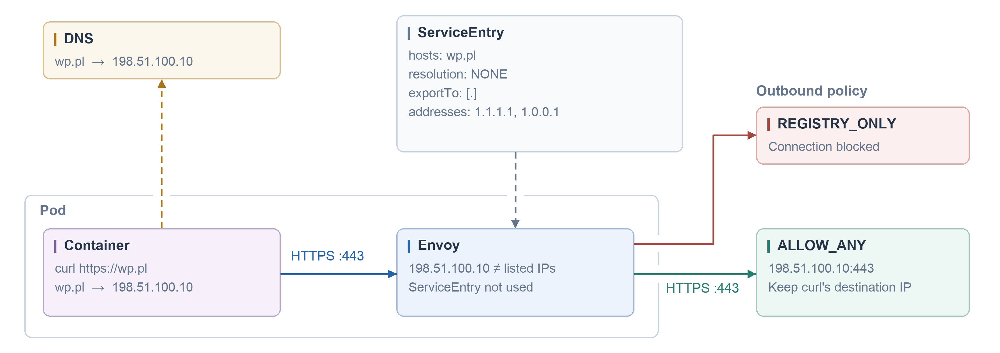
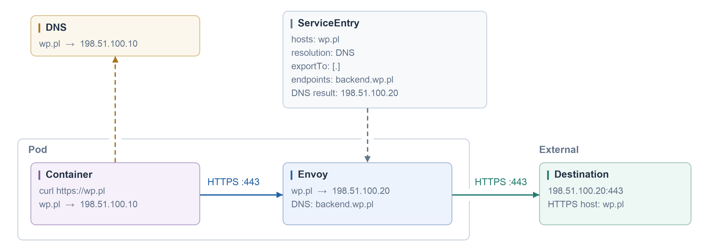
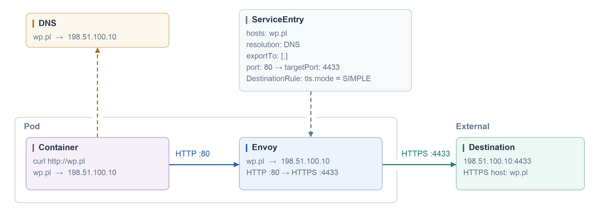

#### Normal

```yaml
apiVersion: networking.istio.io/v1
kind: ServiceEntry
metadata:
  name: default
spec:
  hosts: [wp.pl]
  location: MESH_EXTERNAL
  resolution: DNS
  ports:
  - number: 443
    name: https
    protocol: TLS
  exportTo: [.]
```



#### Override Egress IP, not DNS IP

```yaml
apiVersion: networking.istio.io/v1
kind: ServiceEntry
metadata:
  name: default
spec:
  hosts: [wp.pl]
  location: MESH_EXTERNAL
  resolution: STATIC
  ports:
  - number: 443
    name: https
    protocol: TLS
  endpoints:
  - address: 8.8.8.8
  exportTo: [.]
```



#### `addresses` without `endpoints`: matching, not an IP override

- `addresses` identifies the service by destination IP/VIP; it does not specify a replacement backend.
- `endpoints` specifies backend destinations, as in the `STATIC` example above.
- With `resolution: NONE`, Envoy keeps the original destination IP selected by the application. Envoy does not perform a backend DNS lookup for this entry.

```yaml
apiVersion: networking.istio.io/v1
kind: ServiceEntry
metadata:
  name: external-redis
spec:
  hosts: [redis.example.com]
  addresses: [10.20.30.40]
  ports:
  - number: 6379
    name: tcp-redis
    protocol: TCP
  location: MESH_EXTERNAL
  resolution: NONE
  exportTo: [.]
```

If the application's DNS lookup returns `10.20.30.50`, it connects to `10.20.30.50:6379`. This TCP ServiceEntry does **not** match: it declares `10.20.30.40`. It does not redirect the request to `.40`.

If no other visible service or route matches the connection:

| Outbound policy | Result |
|---|---|
| `ALLOW_ANY` | Envoy passes traffic to the original `10.20.30.50:6379` as an unknown destination. |
| `REGISTRY_ONLY` | Envoy rejects the unknown destination. |

The policy is configured through `meshConfig.outboundTrafficPolicy.mode` or an applicable `Sidecar` resource; it is not a ServiceEntry field. Envoy matches the connection's destination, not a DNS response against YAML. This example is plain TCP; HTTP Host and TLS SNI can also participate in service matching. `REGISTRY_ONLY` is not a complete outbound security boundary.

References: [ServiceEntry](https://istio.io/latest/docs/reference/config/networking/service-entry/), [outbound traffic policy](https://istio.io/latest/docs/reference/config/networking/sidecar/#OutboundTrafficPolicy).

#### Original destination — resolution: NONE

```yaml
apiVersion: networking.istio.io/v1
kind: ServiceEntry
metadata:
  name: default
spec:
  hosts: [wp.pl]
  addresses: [1.1.1.1, 1.0.0.1]
  ports:
  - number: 443
    name: https
    protocol: TLS
  location: MESH_EXTERNAL
  resolution: NONE
  exportTo: [.]
```



#### DNS Resolution + Different Domain

```yaml
apiVersion: networking.istio.io/v1
kind: ServiceEntry
metadata:
  name: default
spec:
  hosts: [wp.pl]
  location: MESH_EXTERNAL
  resolution: DNS
  ports:
  - number: 443
    name: https
    protocol: TLS
  endpoints:
  - address: backend.wp.pl
  exportTo: [.]
```



#### Istio 80, egress 4433

```yaml
apiVersion: networking.istio.io/v1
kind: ServiceEntry
metadata:
  name: wp
spec:
  hosts: [wp.pl]
  location: MESH_EXTERNAL
  resolution: DNS
  ports:
  - number: 80
    name: http
    protocol: HTTP
    targetPort: 4433
  exportTo: [.]
---
apiVersion: networking.istio.io/v1
kind: DestinationRule
metadata:
  name: external-api
spec:
  host: wp.pl
  trafficPolicy:
    portLevelSettings:
    - port:
        number: 80
      tls:
        mode: SIMPLE
  exportTo: [.]
```


