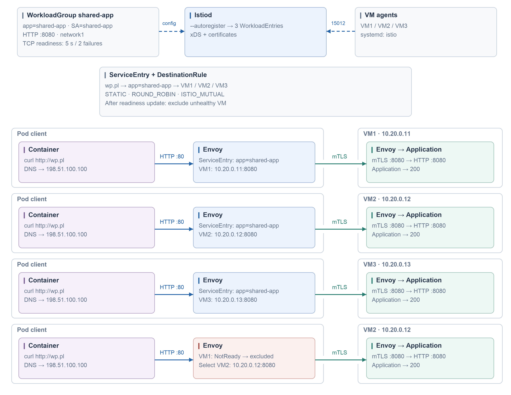
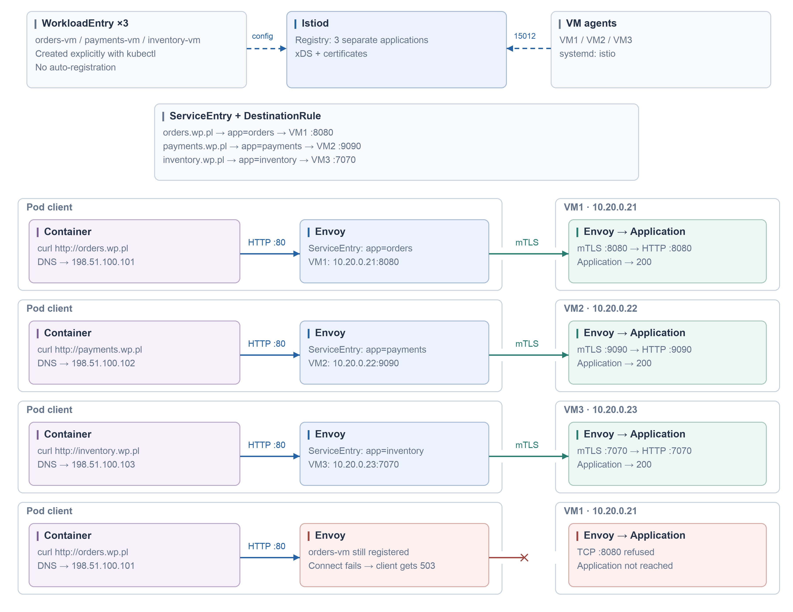

## 1. WorkloadGroup — one application on three VMs

#### Workstation

```bash
export ISTIO_VERSION=1.30.5
export CLUSTER_ID=cluster1
export ISTIOD_IP=192.0.2.10
export ISTIO_REVISION=green
export VM_USER=ubuntu
istioctl version --remote=false
```

```yaml
apiVersion: v1
kind: ServiceAccount
metadata:
  name: shared-app
---
apiVersion: networking.istio.io/v1
kind: WorkloadGroup
metadata:
  name: shared-app
spec:
  metadata:
    labels:
      app: shared-app
  template:
    serviceAccount: shared-app
    network: network1
    ports:
      http: 8080
  probe:
    initialDelaySeconds: 1
    periodSeconds: 5
    failureThreshold: 2
    tcpSocket:
      port: 8080
---
apiVersion: networking.istio.io/v1
kind: ServiceEntry
metadata:
  name: shared-app
spec:
  hosts: [wp.pl]
  addresses: [198.51.100.100]
  exportTo: [.]
  location: MESH_INTERNAL
  resolution: STATIC
  ports:
  - number: 80
    name: http
    protocol: HTTP
  workloadSelector:
    labels:
      app: shared-app
---
apiVersion: networking.istio.io/v1
kind: DestinationRule
metadata:
  name: shared-app
spec:
  host: wp.pl
  exportTo: [.]
  trafficPolicy:
    loadBalancer:
      simple: ROUND_ROBIN
    tls:
      mode: ISTIO_MUTUAL
---
apiVersion: networking.istio.io/v1beta1
kind: ProxyConfig
metadata:
  name: default
spec:
  environmentVariables:
    ISTIO_META_DNS_CAPTURE: 'true'
```



#### Register + bootstrap

```bash
kubectl apply -f vm-workloads/workload-group.yaml
```

```bash
set -euo pipefail
umask 077
: "${CLUSTER_ID:?Set CLUSTER_ID to the installed mesh cluster ID}"
: "${ISTIOD_IP:?Set ISTIOD_IP to the reachable xDS/CA gateway IP}"
workload_namespace="$(kubectl config view --minify -o jsonpath='{.contexts[0].context.namespace}')"
workload_namespace="${workload_namespace:-default}"

for item in vm1:10.20.0.11 vm2:10.20.0.12 vm3:10.20.0.13; do
  vm_name="${item%%:*}"
  vm_ip="${item#*:}"
  istioctl x workload entry configure \
    --name shared-app --namespace "$workload_namespace" \
    --clusterID "$CLUSTER_ID" --ingressIP "$ISTIOD_IP" \
    --internalIP "$vm_ip" --autoregister \
    --revision "${ISTIO_REVISION:-}" --output ".local/vm-group/$vm_name"
done
```

#### Generated files

```text
cluster.env   → /var/lib/istio/envoy/cluster.env
mesh.yaml     → /etc/istio/config/mesh
root-cert.pem → /etc/certs/root-cert.pem
istio-token   → /var/lib/istio/istio-token
              → /var/run/secrets/tokens/istio-token
hosts         → /etc/hosts
```

#### Copy

```bash
for item in vm1:10.20.0.11 vm2:10.20.0.12 vm3:10.20.0.13; do
  vm_name="${item%%:*}"
  vm_ip="${item#*:}"
  ssh "$VM_USER@$vm_ip" 'mkdir -p "$HOME/istio-bootstrap"; chmod 700 "$HOME/istio-bootstrap"'
  scp ".local/vm-group/$vm_name/"{cluster.env,mesh.yaml,root-cert.pem,istio-token,hosts} \
    vm-workloads/install-vm.sh "$VM_USER@$vm_ip:istio-bootstrap/"
done
```

#### On each VM

```bash
export ISTIO_VERSION=1.30.5
sudo env ISTIO_VERSION="$ISTIO_VERSION" bash "$HOME/istio-bootstrap/install-vm.sh" "$HOME/istio-bootstrap"
sudo systemctl status istio --no-pager
curl -fsS http://127.0.0.1:15021/healthz/ready
```

#### Check

```bash
kubectl get workloadentry -l app=shared-app -o wide
istioctl proxy-status
kubectl run vm-client --image=curlimages/curl:8.16.0 --restart=Never --command -- sleep 3600
kubectl wait pod/vm-client --for=condition=Ready --timeout=120s
kubectl exec vm-client -c vm-client -- curl -sS http://wp.pl
```

#### Renew token

```bash
kubectl create token shared-app --audience=istio-ca --duration=1h > .local/vm-group/vm1/istio-token
```

## 2. WorkloadEntry — three applications on three VMs

```yaml
apiVersion: v1
kind: ServiceAccount
metadata:
  name: orders
---
apiVersion: networking.istio.io/v1
kind: WorkloadEntry
metadata:
  name: orders-vm
spec:
  address: 10.20.0.21
  ports:
    http: 8080
  labels:
    app: orders
  network: network1
  serviceAccount: orders
---
apiVersion: networking.istio.io/v1
kind: ServiceEntry
metadata:
  name: orders
spec:
  hosts: [orders.wp.pl]
  addresses: [198.51.100.101]
  exportTo: [.]
  location: MESH_INTERNAL
  resolution: STATIC
  ports:
  - number: 80
    name: http
    protocol: HTTP
  workloadSelector:
    labels:
      app: orders
---
apiVersion: v1
kind: ServiceAccount
metadata:
  name: payments
---
apiVersion: networking.istio.io/v1
kind: WorkloadEntry
metadata:
  name: payments-vm
spec:
  address: 10.20.0.22
  ports:
    http: 9090
  labels:
    app: payments
  network: network1
  serviceAccount: payments
---
apiVersion: networking.istio.io/v1
kind: ServiceEntry
metadata:
  name: payments
spec:
  hosts: [payments.wp.pl]
  addresses: [198.51.100.102]
  exportTo: [.]
  location: MESH_INTERNAL
  resolution: STATIC
  ports:
  - number: 80
    name: http
    protocol: HTTP
  workloadSelector:
    labels:
      app: payments
---
apiVersion: v1
kind: ServiceAccount
metadata:
  name: inventory
---
apiVersion: networking.istio.io/v1
kind: WorkloadEntry
metadata:
  name: inventory-vm
spec:
  address: 10.20.0.23
  ports:
    http: 7070
  labels:
    app: inventory
  network: network1
  serviceAccount: inventory
---
apiVersion: networking.istio.io/v1
kind: ServiceEntry
metadata:
  name: inventory
spec:
  hosts: [inventory.wp.pl]
  addresses: [198.51.100.103]
  exportTo: [.]
  location: MESH_INTERNAL
  resolution: STATIC
  ports:
  - number: 80
    name: http
    protocol: HTTP
  workloadSelector:
    labels:
      app: inventory
---
apiVersion: networking.istio.io/v1
kind: DestinationRule
metadata:
  name: vm-apps
spec:
  host: '*.wp.pl'
  exportTo: [.]
  trafficPolicy:
    tls:
      mode: ISTIO_MUTUAL
---
apiVersion: networking.istio.io/v1beta1
kind: ProxyConfig
metadata:
  name: default
spec:
  environmentVariables:
    ISTIO_META_DNS_CAPTURE: 'true'
```



#### Register + bootstrap

```bash
kubectl apply -f vm-workloads/workload-entry.yaml
```

```bash
set -euo pipefail
umask 077
: "${CLUSTER_ID:?Set CLUSTER_ID to the installed mesh cluster ID}"
: "${ISTIOD_IP:?Set ISTIOD_IP to the reachable xDS/CA gateway IP}"
workload_namespace="$(kubectl config view --minify -o jsonpath='{.contexts[0].context.namespace}')"
workload_namespace="${workload_namespace:-default}"

for item in orders:10.20.0.21:8080 payments:10.20.0.22:9090 inventory:10.20.0.23:7070; do
  IFS=: read -r app vm_ip app_port <<< "$item"
  output=".local/vm-entry/$app"
  mkdir -p "$output"
  istioctl x workload group create \
    --name "$app-vm" --namespace "$workload_namespace" \
    --labels "app=$app" --ports "http=$app_port" \
    --serviceAccount "$app" --network network1 > "$output/workloadgroup.yaml"
  istioctl x workload entry configure \
    --file "$output/workloadgroup.yaml" \
    --clusterID "$CLUSTER_ID" --ingressIP "$ISTIOD_IP" \
    --internalIP "$vm_ip" --autoregister=false \
    --revision "${ISTIO_REVISION:-}" --output "$output"
done
```

#### Copy + install

```bash
for item in orders:10.20.0.21 payments:10.20.0.22 inventory:10.20.0.23; do
  app="${item%%:*}"
  vm_ip="${item#*:}"
  ssh "$VM_USER@$vm_ip" 'mkdir -p "$HOME/istio-bootstrap"; chmod 700 "$HOME/istio-bootstrap"'
  scp ".local/vm-entry/$app/"{cluster.env,mesh.yaml,root-cert.pem,istio-token,hosts} \
    vm-workloads/install-vm.sh "$VM_USER@$vm_ip:istio-bootstrap/"
done
```

```bash
export ISTIO_VERSION=1.30.5
sudo env ISTIO_VERSION="$ISTIO_VERSION" bash "$HOME/istio-bootstrap/install-vm.sh" "$HOME/istio-bootstrap"
curl -fsS http://127.0.0.1:15021/healthz/ready
```

#### Check

```bash
kubectl get workloadentry orders-vm payments-vm inventory-vm -o wide
istioctl proxy-status
kubectl exec vm-client -c vm-client -- curl -sS http://orders.wp.pl
kubectl exec vm-client -c vm-client -- curl -sS http://payments.wp.pl
kubectl exec vm-client -c vm-client -- curl -sS http://inventory.wp.pl
```
