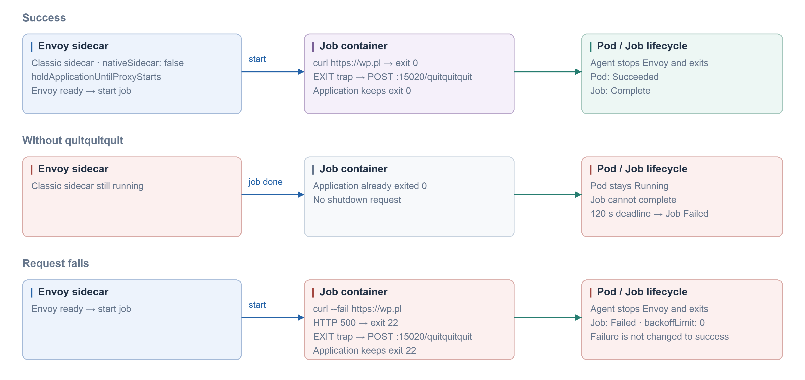

#### CronJob · native sidecar · Kubernetes 1.33+

```yaml
apiVersion: batch/v1
kind: CronJob
metadata:
  name: curl-wp
spec:
  schedule: '*/5 * * * *'
  concurrencyPolicy: Forbid
  successfulJobsHistoryLimit: 1
  failedJobsHistoryLimit: 1
  jobTemplate:
    spec:
      backoffLimit: 0
      activeDeadlineSeconds: 120
      ttlSecondsAfterFinished: 3600
      template:
        metadata:
          labels:
            sidecar.istio.io/inject: 'true'
          annotations:
            sidecar.istio.io/nativeSidecar: 'true'
        spec:
          restartPolicy: Never
          containers:
          - name: job
            image: curlimages/curl:8.16.0
            command: [curl]
            args: [--fail, --show-error, --silent, --connect-timeout, '10', --max-time, '30', 'https://wp.pl']
```

#### Istiod Helm · startup probe

```yaml
global:
  proxy:
    startupProbe:
      enabled: true
```


#### CronJob · classic sidecar + quitquitquit

```yaml
apiVersion: batch/v1
kind: CronJob
metadata:
  name: curl-wp-quitquitquit
spec:
  schedule: '*/5 * * * *'
  concurrencyPolicy: Forbid
  successfulJobsHistoryLimit: 1
  failedJobsHistoryLimit: 1
  jobTemplate:
    spec:
      backoffLimit: 0
      activeDeadlineSeconds: 120
      ttlSecondsAfterFinished: 3600
      template:
        metadata:
          labels:
            sidecar.istio.io/inject: 'true'
          annotations:
            sidecar.istio.io/nativeSidecar: 'false'
            proxy.istio.io/config: |
              holdApplicationUntilProxyStarts: true
        spec:
          restartPolicy: Never
          containers:
          - name: job
            image: curlimages/curl:8.16.0
            command: [/bin/sh, -c]
            args:
            - |
              set -eu
              finish() {
                result=$?
                trap - EXIT
                if ! curl --fail --silent --show-error --max-time 5 \
                  --retry 2 --retry-connrefused --request POST \
                  http://127.0.0.1:15020/quitquitquit; then
                  if [ "$result" -eq 0 ]; then result=1; fi
                fi
                exit "$result"
              }
              trap finish EXIT
              trap 'exit 143' TERM
              trap 'exit 130' INT
              curl --fail --silent --show-error \
                --connect-timeout 10 --max-time 30 https://wp.pl
```


